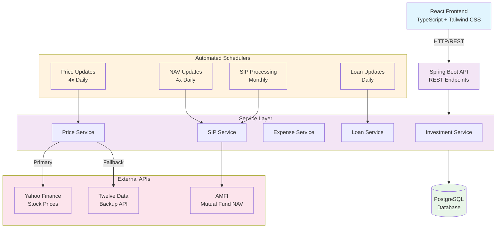

# Finance Tracker

A full-stack personal finance management application with real-time market data integration, automated portfolio tracking, and comprehensive financial analytics.

## System Architecture



## Tech Stack

**Backend**: Spring Boot 3.4.5, Java 21, PostgreSQL, Spring Data JPA, Maven  
**Frontend**: React 18, TypeScript, Vite, Tailwind CSS, Recharts  
**APIs**: Yahoo Finance (stocks), AMFI (mutual funds), Twelve Data (backup)

## Key Features

- **Real-time Portfolio Tracking**: Automated price updates 4x daily
- **SIP Management**: Monthly automated investment processing with NAV tracking
- **Expense Analytics**: Categorized spending analysis with visualizations
- **Loan Calculator**: EMI tracking with balance updates
- **Data Export**: PDF/Excel report generation
- **API Failover**: Dual API integration for high reliability

## Quick Start

### Prerequisites
- Java 21+, Node.js (LTS), Maven 3.6+, PostgreSQL

### Backend Setup
```bash
git clone <repository-url>
cd Finance_Tracker-API

# Configure application.properties
spring.datasource.url=jdbc:postgresql://localhost:5432/finance_tracker
spring.datasource.username=your_username
spring.datasource.password=your_password
twelvedata.api.key=your_api_key_here  # Optional

./mvnw spring-boot:run  # Starts on :8080
```

### Frontend Setup
```bash
cd Finance_Tracker-UI
npm install
npm run dev  # Starts on :5173
```

## API Endpoints

| Endpoint | Method | Description |
|----------|--------|-------------|
| `/api/investments` | GET/POST | Portfolio management |
| `/api/investments/summary` | GET | Portfolio overview |
| `/api/sips` | GET/POST | SIP tracking |
| `/api/expenses` | GET/POST | Expense management |
| `/api/loans` | GET/POST | Loan calculations |

## Automated Schedulers

```java
@Scheduled(cron = "0 0 9,12,15,18 * * *")  // Price Updates
@Scheduled(cron = "0 0 9 1 * *")           // Monthly SIP Processing
@Scheduled(cron = "0 0 0 * * *")           // Daily Loan Updates
```

## External API Integration

**Yahoo Finance**: Real-time stock prices with automatic symbol formatting (RELIANCE → RELIANCE.NS)  
**AMFI**: Official mutual fund NAV data via CSV parsing  
**Twelve Data**: Backup API with NSE/BSE support and rate limiting

## Production Build

```bash
# Backend
./mvnw clean package -Pprod

# Frontend
npm run build
```

## Configuration

**Development**: H2 in-memory database  
**Production**: PostgreSQL with connection pooling  
**Scheduling**: Configurable cron expressions for different market timings  
**Rate Limiting**: 10s delays for Yahoo Finance, 8s for Twelve Data

## Performance Features

- API response caching for NAV data
- Batch processing for portfolio updates  
- Database indexing for optimized queries
- Connection pooling for efficient DB access
- Exponential backoff for API failures

## License

MIT License - Built for better financial management and investment tracking